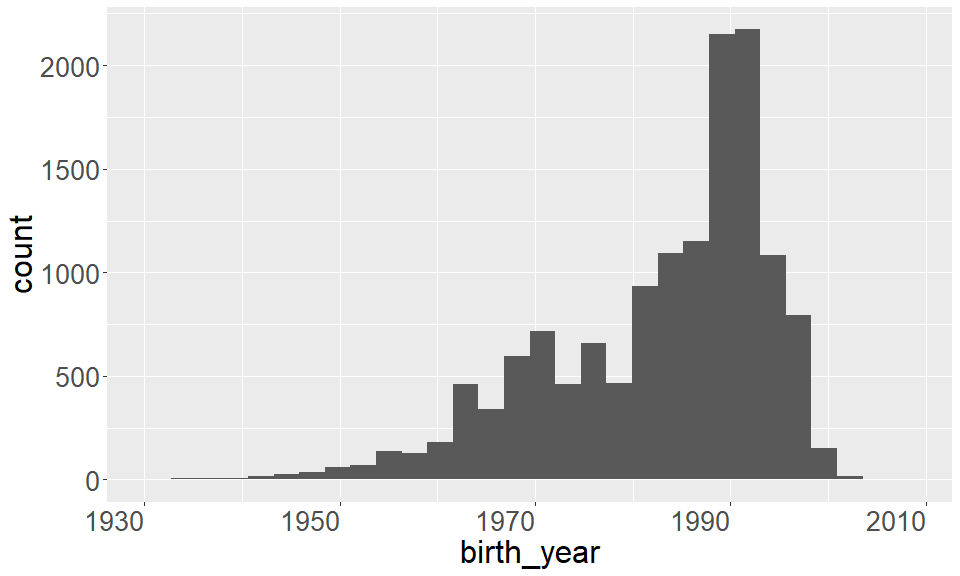
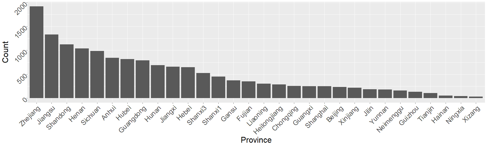
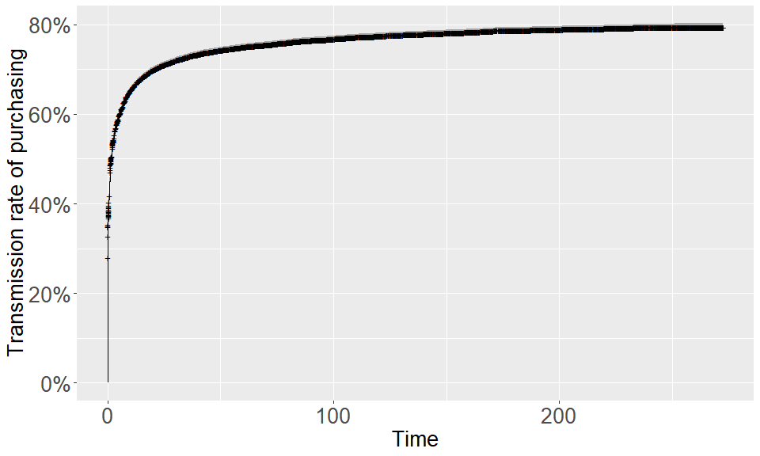
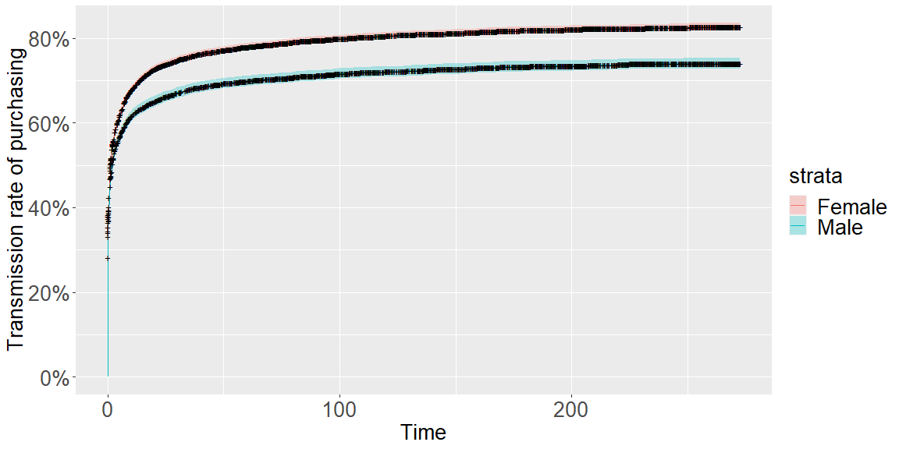
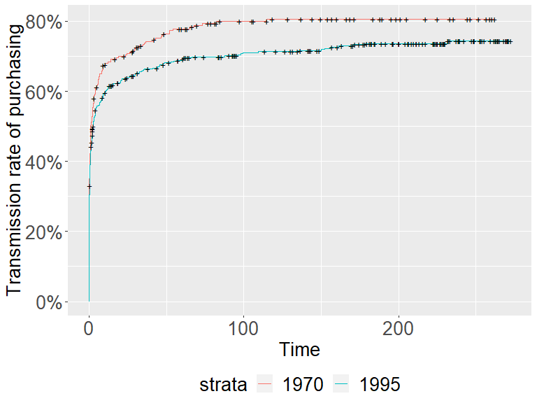
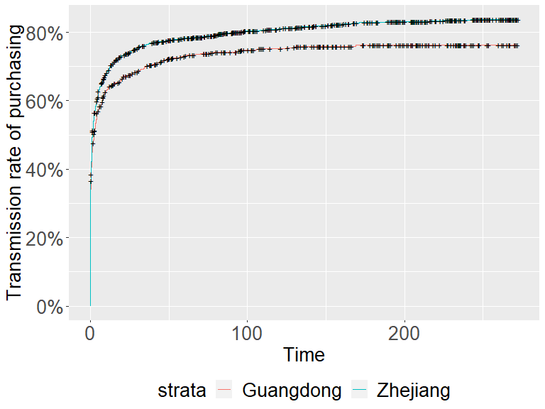
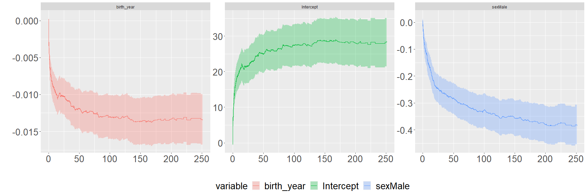

    library(tidyverse)
    library(ggfortify)
    library(MASS)
    library(survival)
    library(lubridate)

# Appendix

## EDA

    data1 %>% ggplot(aes(x = birth_year)) + 
      geom_histogram() + 
      theme(axis.text = element_text(size = 20, hjust = 1), 
            axis.title = element_text(size = 24), 
            plot.title = element_text(size = 20))

    data1 %>% group_by(province) %>% 
        summarise(count = n()) %>% 
        ggplot(aes(x = reorder(province,(-count)), y = count)) + 
      geom_bar(stat = 'identity') + 
      labs(x = "Province", y = "Count") +
      theme(axis.text = element_text(size = 20, angle = 45, hjust = 1), 
            axis.title = element_text(size = 24), 
            plot.title = element_text(size = 20))

    fitsurv <- survfit(Surv(duration, have_bought) ~ 1, data = data1)

    autoplot(fitsurv, fun = "event") + 
      labs(x = "Time", y = "Transmission rate of purchasing") + 
      theme(axis.text = element_text(size = 20), 
            axis.title = element_text(size = 20), 
            plot.title = element_text(size = 20))

    fitsurv <- survfit(Surv(duration, have_bought) ~ sex, data = data1)

    autoplot(fitsurv, fun='event') + 
      labs(x = "Time", y = "Transmission rate of purchasing") + 
      theme(axis.text = element_text(size = 20), 
            axis.title = element_text(size = 20), 
            plot.title = element_text(size = 20), 
            legend.text = element_text(size = 20), 
            legend.title = element_text(size = 20))

Log-Rank Test

    survdiff(Surv(duration, have_bought) ~ sex, data = data1)

    ## Call:
    ## survdiff(formula = Surv(duration, have_bought) ~ sex, data = data1)
    ## 
    ##               N Observed Expected (O-E)^2/E (O-E)^2/V
    ## sex=Female 9691     7706     7216      33.3      87.5
    ## sex=Male   5526     3953     4443      54.0      87.5
    ## 
    ##  Chisq= 87.5  on 1 degrees of freedom, p= <2e-16

    data11 <- data1 %>% filter(birth_year %in% c(1970, 1995))

    fitsurv <- survfit(Surv(duration, have_bought) ~ birth_year, data = data11)

    autoplot(fitsurv, fun='event', conf.int = FALSE) + 
      labs(x = "Time", y = "Transmission rate of purchasing") + 
      theme(axis.text = element_text(size = 20), 
            axis.title = element_text(size = 20), 
            plot.title = element_text(size = 20), 
            legend.text = element_text(size = 20), 
            legend.title = element_text(size = 20), 
            legend.position="bottom")

Log-Rank Test

    survdiff(Surv(duration, have_bought) ~ birth_year, data = data11)

    ## Call:
    ## survdiff(formula = Surv(duration, have_bought) ~ birth_year, 
    ##     data = data11)
    ## 
    ##                   N Observed Expected (O-E)^2/E (O-E)^2/V
    ## birth_year=1970 265      208      183      3.34      5.05
    ## birth_year=1995 475      338      363      1.69      5.05
    ## 
    ##  Chisq= 5.1  on 1 degrees of freedom, p= 0.02

    data12 <- data1 %>% filter(province %in% c("Guangdong", "Zhejiang"))

    fitsurv <- survfit(Surv(duration, have_bought) ~ province, data = data12)

    autoplot(fitsurv, fun='event', conf.int = FALSE) + 
      labs(x = "Time", y = "Transmission rate of purchasing") + 
      theme(axis.text = element_text(size = 20), 
            axis.title = element_text(size = 20), 
            plot.title = element_text(size = 20), 
            legend.text = element_text(size = 20), 
            legend.title = element_text(size = 20), 
            legend.position="bottom")

Log-Rank Test

    survdiff(Surv(duration, have_bought) ~ province, data = data12)

    ## Call:
    ## survdiff(formula = Surv(duration, have_bought) ~ province, data = data12)
    ## 
    ##                       N Observed Expected (O-E)^2/E (O-E)^2/V
    ## province=Guangdong  791      584      652      7.19      10.4
    ## province=Zhejiang  1921     1545     1477      3.18      10.4
    ## 
    ##  Chisq= 10.4  on 1 degrees of freedom, p= 0.001

## Cox PH Model

    cox0 <- coxph(Surv(duration, have_bought) ~ sex + birth_year + province, data = data1)
    summary(cox0)

    ## Call:
    ## coxph(formula = Surv(duration, have_bought) ~ sex + birth_year + 
    ##     province, data = data1)
    ## 
    ##   n= 13923, number of events= 10664 
    ##    (1294 observations deleted due to missingness)
    ## 
    ##                            coef  exp(coef)   se(coef)      z Pr(>|z|)    
    ## sexMale              -0.1707248  0.8430535  0.0205737 -8.298  < 2e-16 ***
    ## birth_year           -0.0077861  0.9922441  0.0008579 -9.076  < 2e-16 ***
    ## provinceBeijing      -0.0102128  0.9898392  0.0864863 -0.118  0.90600    
    ## provinceChongqing    -0.0085490  0.9914874  0.0865960 -0.099  0.92136    
    ## provinceFujian       -0.0927667  0.9114061  0.0779495 -1.190  0.23401    
    ## provinceGansu         0.0108673  1.0109266  0.0734933  0.148  0.88245    
    ## provinceGuangdong    -0.0623623  0.9395424  0.0597497 -1.044  0.29661    
    ## provinceGuangxi      -0.1220823  0.8850755  0.0876230 -1.393  0.16354    
    ## provinceGuizhou      -0.3695688  0.6910322  0.1197944 -3.085  0.00204 ** 
    ## provinceHainan        0.0297775  1.0302253  0.1673502  0.178  0.85877    
    ## provinceHebei        -0.0367639  0.9639037  0.0629812 -0.584  0.55940    
    ## provinceHeilongjiang  0.0590467  1.0608248  0.0817318  0.722  0.47002    
    ## provinceHenan        -0.1029529  0.9021695  0.0558249 -1.844  0.06515 .  
    ## provinceHubei        -0.0227530  0.9775039  0.0589246 -0.386  0.69939    
    ## provinceHunan        -0.0556195  0.9458989  0.0613532 -0.907  0.36465    
    ## provinceJiangsu      -0.0155172  0.9846026  0.0524167 -0.296  0.76720    
    ## provinceJiangxi       0.0275906  1.0279747  0.0618486  0.446  0.65553    
    ## provinceJilin        -0.0714992  0.9309971  0.0981312 -0.729  0.46624    
    ## provinceLiaoning      0.1086879  1.1148143  0.0782748  1.389  0.16497    
    ## provinceNeimenggu    -0.0618231  0.9400492  0.1023211 -0.604  0.54571    
    ## provinceNingxia      -0.1179891  0.8887057  0.1934290 -0.610  0.54187    
    ## provinceShandong     -0.0464944  0.9545699  0.0544445 -0.854  0.39312    
    ## provinceShanghai     -0.0010246  0.9989760  0.0864354 -0.012  0.99054    
    ## provinceShanxi1      -0.0650619  0.9370094  0.0707698 -0.919  0.35791    
    ## provinceShanxi3       0.0490819  1.0503063  0.0655969  0.748  0.45432    
    ## provinceSichuan      -0.0866114  0.9170334  0.0563998 -1.536  0.12462    
    ## provinceTianjin      -0.0718040  0.9307133  0.1240921 -0.579  0.56284    
    ## provinceXinjiang     -0.1747035  0.8397060  0.0913554 -1.912  0.05583 .  
    ## provinceXizang        0.0368044  1.0374901  0.2221521  0.166  0.86842    
    ## provinceYunnan       -0.2328094  0.7923045  0.1034387 -2.251  0.02440 *  
    ## provinceZhejiang      0.0218087  1.0220482  0.0491403  0.444  0.65718    
    ## ---
    ## Signif. codes:  0 '***' 0.001 '**' 0.01 '*' 0.05 '.' 0.1 ' ' 1
    ## 
    ##                      exp(coef) exp(-coef) lower .95 upper .95
    ## sexMale                 0.8431     1.1862    0.8097    0.8777
    ## birth_year              0.9922     1.0078    0.9906    0.9939
    ## provinceBeijing         0.9898     1.0103    0.8355    1.1727
    ## provinceChongqing       0.9915     1.0086    0.8367    1.1749
    ## provinceFujian          0.9114     1.0972    0.7823    1.0618
    ## provinceGansu           1.0109     0.9892    0.8753    1.1676
    ## provinceGuangdong       0.9395     1.0643    0.8357    1.0563
    ## provinceGuangxi         0.8851     1.1298    0.7454    1.0509
    ## provinceGuizhou         0.6910     1.4471    0.5464    0.8739
    ## provinceHainan          1.0302     0.9707    0.7421    1.4301
    ## provinceHebei           0.9639     1.0374    0.8520    1.0905
    ## provinceHeilongjiang    1.0608     0.9427    0.9038    1.2451
    ## provinceHenan           0.9022     1.1084    0.8087    1.0065
    ## provinceHubei           0.9775     1.0230    0.8709    1.0972
    ## provinceHunan           0.9459     1.0572    0.8387    1.0668
    ## provinceJiangsu         0.9846     1.0156    0.8885    1.0911
    ## provinceJiangxi         1.0280     0.9728    0.9106    1.1605
    ## provinceJilin           0.9310     1.0741    0.7681    1.1284
    ## provinceLiaoning        1.1148     0.8970    0.9563    1.2997
    ## provinceNeimenggu       0.9400     1.0638    0.7692    1.1488
    ## provinceNingxia         0.8887     1.1252    0.6083    1.2984
    ## provinceShandong        0.9546     1.0476    0.8580    1.0621
    ## provinceShanghai        0.9990     1.0010    0.8433    1.1834
    ## provinceShanxi1         0.9370     1.0672    0.8157    1.0764
    ## provinceShanxi3         1.0503     0.9521    0.9236    1.1944
    ## provinceSichuan         0.9170     1.0905    0.8211    1.0242
    ## provinceTianjin         0.9307     1.0744    0.7298    1.1870
    ## provinceXinjiang        0.8397     1.1909    0.7020    1.0044
    ## provinceXizang          1.0375     0.9639    0.6713    1.6035
    ## provinceYunnan          0.7923     1.2621    0.6469    0.9704
    ## provinceZhejiang        1.0220     0.9784    0.9282    1.1254
    ## 
    ## Concordance= 0.533  (se = 0.003 )
    ## Likelihood ratio test= 209.1  on 31 df,   p=<2e-16
    ## Wald test            = 208.6  on 31 df,   p=<2e-16
    ## Score (logrank) test = 209.2  on 31 df,   p=<2e-16

    cox1 <- coxph(Surv(duration, have_bought) ~ sex + birth_year, data = data1)
    summary(cox1)

    ## Call:
    ## coxph(formula = Surv(duration, have_bought) ~ sex + birth_year, 
    ##     data = data1)
    ## 
    ##   n= 13923, number of events= 10664 
    ##    (1294 observations deleted due to missingness)
    ## 
    ##                  coef  exp(coef)   se(coef)      z Pr(>|z|)    
    ## sexMale    -0.1742161  0.8401153  0.0204674 -8.512   <2e-16 ***
    ## birth_year -0.0080673  0.9919652  0.0008398 -9.606   <2e-16 ***
    ## ---
    ## Signif. codes:  0 '***' 0.001 '**' 0.01 '*' 0.05 '.' 0.1 ' ' 1
    ## 
    ##            exp(coef) exp(-coef) lower .95 upper .95
    ## sexMale       0.8401      1.190    0.8071    0.8745
    ## birth_year    0.9920      1.008    0.9903    0.9936
    ## 
    ## Concordance= 0.529  (se = 0.003 )
    ## Likelihood ratio test= 165.3  on 2 df,   p=<2e-16
    ## Wald test            = 166.1  on 2 df,   p=<2e-16
    ## Score (logrank) test = 166.4  on 2 df,   p=<2e-16

## Aalen’s Additive Model

    fit1 <- aareg(Surv(duration, have_bought) ~ sex + birth_year, data = data1)

    summary(fit1)

    ## $table
    ##                    slope          coef     se(coef)         z            p
    ## Intercept   1.3020189450  2.057277e-03 2.102398e-04  9.785383 1.301012e-22
    ## sexMale    -0.0099893522 -2.011036e-05 2.329677e-06 -8.632251 6.015611e-18
    ## birth_year -0.0006164134 -9.748628e-07 1.059690e-07 -9.199513 3.595767e-20
    ## 
    ## $test
    ## [1] "aalen"
    ## 
    ## $test.statistic
    ##     Intercept       sexMale    birth_year 
    ##      5.865116   -424.694797 -10932.048735 
    ## 
    ## $test.var
    ##              b0                           
    ## b0    0.3592506     0.7158003    -712.2374
    ##       0.7158003  2420.5036600   -1686.7313
    ##    -712.2373740 -1686.7312580 1412126.0779
    ## 
    ## $test.var2
    ## NULL
    ## 
    ## $chisq
    ##          [,1]
    ## [1,] 163.8654
    ## 
    ## $n
    ## [1] 13923  8289  8289
    ## 
    ## attr(,"class")
    ## [1] "summary.aareg"

    autoplot(fit1) + 
      theme(axis.text = element_text(size = 20), 
            axis.title = element_text(size = 20), 
            plot.title = element_text(size = 20), 
            legend.text = element_text(size = 20), 
            legend.title = element_text(size = 20), 
            legend.position="bottom")

    ## Warning: `mutate_()` was deprecated in dplyr 0.7.0.
    ## Please use `mutate()` instead.
    ## See vignette('programming') for more help

    ## Warning: `group_by_()` was deprecated in dplyr 0.7.0.
    ## Please use `group_by()` instead.
    ## See vignette('programming') for more help

